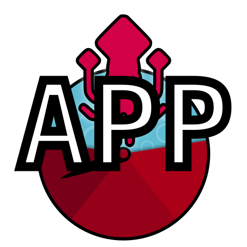

KaMI App
=====


[](https://opensource.org/licenses/MIT) [](https://kami-app.herokuapp.com/) 

Web application to evaluate transcription task (HTR/OCR) based on Python [KaMI-lib](https://github.com/KaMI-tools-project/KaMi-lib) package.

## Go check the application on heroku

➡️ https://kami-app.herokuapp.com/

## Run the app locally

- clone repo

ex: `git clone git@gitlab.inria.fr:dh-projects/kami/kami-app.git`

- move to kami-app directory

ex: `cd kami-app/`

- create a virtual environment based on Python 3.7 with conda or virtualenv

ex: `virtualenv env -p python3.7`

- activate the virtual environment

ex: `source env/bin/activate`

- install dependancies

ex: `pip install -r requirements.txt`

> note: on Linux 20.04, it might be necessary to [install python3.7-dev](https://stackoverflow.com/questions/32595050/sudo-pip-install-python-levenshtein-failed-with-error-code-1)

- move to kami-app/kami-app directory and set flask environment

```
cd kami-app/
export FLASK_APP=run.py
```

> the command can be different on Windows


To start the app, simply run: `flask run`


